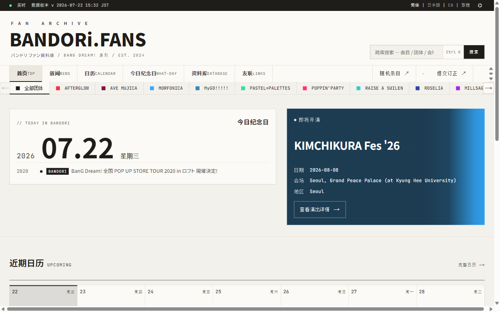
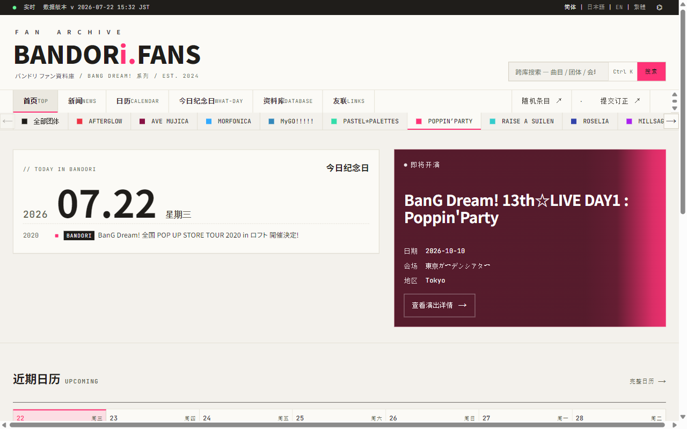
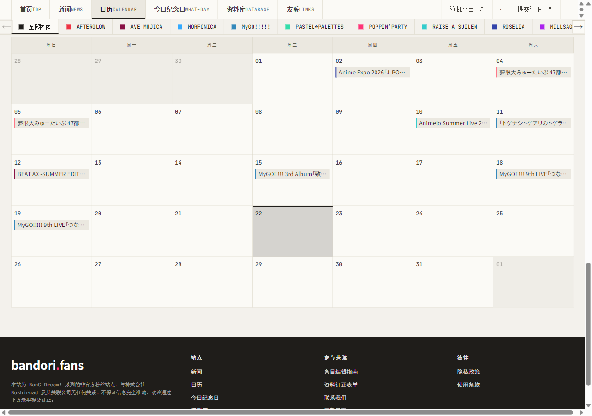
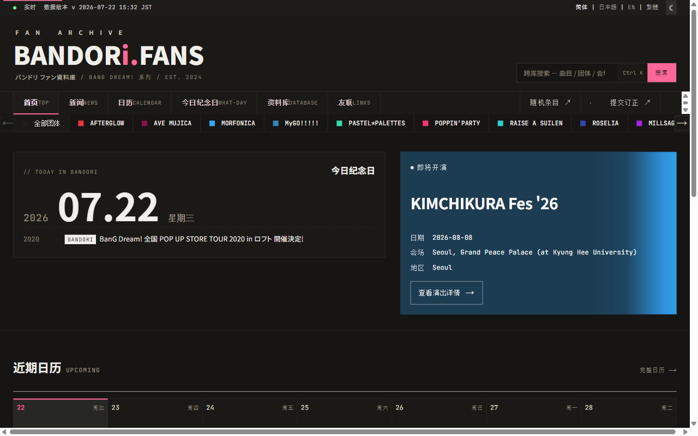

**简体中文** · [日本語](README.ja.md) · [English](README.en.md)

# 🎸 bandori.fans

**你的非官方 BanG Dream! 粉丝资料库**

10 个团体 · 上千首歌 · 数百场演出 · 声优生日 · CD/BD 发售情报 —— 一处查齐,全部互链,由粉丝义工共同维护。

**[🌐 访问网站](https://bandori.fans)**　·　**[💬 反馈 / 提交订正](../../issues)**

---

<picture>
  <source media="(prefers-color-scheme: dark)" srcset=".github/assets/home-hero-dark.png">
  <source media="(prefers-color-scheme: light)" srcset=".github/assets/home-hero-light.png">
  
</picture>

> [!NOTE]
> 🔴 本项目是 **「北美邦 CiRCLE 重建 · 邦多利复兴计划」** 的一部分 —— 北美炸梦同好会用代码,为北美华语圈的邦多利同好,重建一处像 CiRCLE 一样的聚集地。
> 发起方 → **[北美炸梦Coding组 · bangdream-NA](https://github.com/bangdream-NA)** · 社区 **[bangdream.org](https://bangdream.org)**

> 把 BanG Dream! 系列散落在各个官方渠道的资讯整合到一处 —— 10 个团体、上千首歌、数百场演出、声优生日、CD/BD 发售情报,全部由粉丝义工共同维护,**开放编辑、可订阅日历、可提交订正**。

bandori.fans 是一座为 BanG Dream! 系列(バンドリ)而生的粉丝资料库。无论你想查某场 Live 的完整曲单、追某张 CD 的发售排期、看某位声优今天是不是生日,还是想知道"历史上的今天"发生过哪些大事——在这里都能一处查齐,而且全部互相链接、随手点击就能在整张资料网里自由穿行。

---

## ✨ 核心亮点

- **10 个团体,一键沉浸** —— 选中任意乐队(POPPIN'PARTY、Roselia、MyGO!!!!!、Ave Mujica……),整个网站会染上该团体的专属品牌色,首页、新闻、日历全部随之过滤,只看你关心的那支乐队。

<table>
<tr>
<td align="center" width="50%">
 
// 默认
</td>
<td align="center" width="50%">
 
// 选中 POPPIN'PARTY 后
</td>
</tr>
</table>

- **可订阅的实时日历** —— 一键把演出、活动、CD 发售同步进你常用的 Google / Apple / Outlook 日历,自动更新,再也不错过开票和发售。
- **环环相扣的资料网** —— 歌曲 ⇄ 团体 ⇄ 角色 ⇄ 声优 ⇄ CD ⇄ 演出 ⇄ 会场,任一条目都通向相关条目,顺着链接逛个不停。
- **三语 + 深浅主题** —— 简体 / 日本語 / EN 随心切换,浅色 / 深色 / 跟随系统任你选,选择会被记住。
- **人人可参与** —— 发现错误,任何访客都能在线提交订正;站点完全由粉丝义工共建,非营利、非官方。

---

## 🏠 首页

打开首页,你会看到:

- **实时状态条**:页面最顶部一行,跳动的小圆点 +「实时」字样,告诉你资料更新到了哪一刻(如「数据版本 v 2026-06-24 15:34 JST」);右侧是语言与主题切换。
- **站点标志区**:大号「BANDORi.FANS」标志、一句站点简介,以及一个**全站搜索框**(支持 `Ctrl K` / `⌘ K` 快捷唤起)。
- **团体配色切换条**:横向排列「全部团体」+ 10 支乐队,每个前面有专属颜色的小圆点。选中后全站染色 + 内容过滤,选择会被记住。
- **今日纪念日卡**(// TODAY IN BANDORI):今天的日期 + "历史上的今天"发生过的纪念事件(声优生日、专辑发售纪念、活动纪念等),每行带年份与团体标签。
- **即将开演 Hero**(NEXT LIVE):一张以团体主题色为背景的大色块卡,展示下一场演出的标题、日期、会场、地区,一键「查看演出详情 →」。
- **近期日历预览**(UPCOMING):一条横向日期带,显示从今天起约两周的安排,当天高亮,演出/发售以小色块标出。
- **更多板块卡片**:最新新闻、近期演出、发售、子库索引四张快捷卡,各带实时计数,点击直达。

---

## 📰 新闻

集中追踪 BanG Dream! 全系列的官方与社区资讯。

- **重点新闻横幅**:精选 3 条以大卡片展示,带配图、团体标签、标题与日期。
- **多维筛选(可叠加)**:按**来源**(官方 / Bushiroad / Twitter / 其他)、**时间**(7 / 30 / 90 天内)、**类型**(音乐 / 媒体 / BanG Dream! TV / 演出情报 / 周边 / 歌单 / 线下活动 / 票务……)、以及**团体**过滤。任意筛选生效时一键「重置筛选 ↺」。
- **新闻列表**:每行显示日期、类型、团体、标题(部分带摘要)与来源徽标,支持分页。
- **新闻详情**:正文/摘要、发布与更新日期、来源、相关链接、相关日程(可跳到日历对应活动);底部「在原始来源查看 ↗」直达官网/推文,并推荐同团体的其他新闻。

---

## 📅 日历与订阅

一页看全演出、活动与发售,并能同步到你自己的日历。

- **订阅日历**:提供订阅链接(一键「复制」)+「Google 日历 ↗」「Apple 日历 ↗」「Outlook ↗」三个一键添加按钮,并附「如何添加」分步说明。自动更新;若按团体过滤,订阅源会变成该团体专属(如「订阅 Roselia 日历」)。
- **三种视图**:月历、票务(即将到来的购票时间表)、列表(即将活动日程)。
- **类别筛选**:全部 / 演出 / 活动 / 发售 / 售票 / 谈话 / 粉丝会 / 展览 / 门店活动 / 快闪店 / 联动咖啡,不同类别以不同颜色区分。

<table>
<tr><td align="center">
 
// 日历月视图
</td></tr>
</table>

- **月份导航**:上月 / 今日 / 下月 + 年月选择器;切换时团体、类别、视图选择都会保留。
- **月视图(桌面)**:7 列周网格,今天高亮,过多事件「+N 件」可展开;已取消活动带标记并划线;上方还有「购票时间」面板逐条列出本月购票窗口。
- **移动端**:改为竖向「日程」列表,只列有安排的日期,并附「本月购票窗口」区。

---

## 🎂 今日纪念日

独立的「今日是什么日子?」页,比首页卡片更完整。顶部是日期卡(东京时区),下面是固定 5 个「历史上的今天」分类:

- **乐团周年 ★** —— 今天出道/成立的乐团(附「N 周年」)
- **声优生日 ☆** —— 今天过生日的声优(出于隐私不显示年龄)
- **唱片发售周年 ◇** —— 今天发售过的唱片
- **演出周年 ●** —— 历史上今天举办过的演出
- **新闻周年 ▣** —— 历史上今天发布过的新闻

每条带年份、团体标签和可点标题,直达对应详情。若今天 5 类全空,则展示「明日预览」与「最近 7 天回顾」。

---

## 🗂️ 资料库

「资料库」索引页汇集 **6 个互链子库**,每张卡片带实时数量统计。所有列表页都支持分页、升/降序排序、按团体筛选与「清除筛选」。

### 🎤 演出活动
- **列表**:逐场展示日期、标题(带竖版海报缩略图)、团体、会场、记录(公演场次/曲目数/出演艺人数);可按「即将举办 / 已结束」与团体筛选;已取消演出带删除线徽标。多日巡演按每个演出日各占一行。
- **详情**:横版主视觉大图 + 日期、会场、官方页面;**曲目单 / SETLIST**(每首带序号与演唱团体彩标,可点进歌曲页,多场巡演按场分组);**相关新闻**;**出演艺人**(出演 / 共演 / 曲目演唱 / 相关);多会场巡演还有**巡演会场**。

### 🎵 歌曲
- **列表**:标题(附罗马音)、所属团体(品牌色标签)、发行日、收录于(可点进 CD)、编号与演出/轨数统计。
- **详情**:歌名 + 罗马音、**曲名异译**(别名/本地化译名/多语言)、发行日/时长/编号/演唱者;交叉跳转到团体、**收录 CD**、**演出现场**。

### 🎸 团体
- **列表**:10 张乐队卡片(Logo / 队名 / 罗马音 + 成员数/曲目数/演出场次),可按「进行中 / 已解散」筛选。
- **详情**:全页染该团配色,Hero 展示 Logo,资料含出道日、成员数、状态、别名、系列;多时代阵容有「阵容时代」手风琴;交叉区列出成员、歌曲、演出、新闻、角色、CD 作品、演出曲单。

### 👤 角色
- **列表**:角色头像卡(角色名 / 所属团体 / CV 声优名),可按团体筛选。
- **详情**:角色立绘 Hero、姓名读音;可点的团体与声优标签;乐队成员还含担当(乐器位)、生日、星座、血型、身高、三围、代表色等;**声优历代**、**演出曲目**、按年份折叠的**出场履历**,以及社交账号。

### 🎙️ 声优
- **列表**:先以「按团体浏览」总览呈现(每团显示声优数),下钻后显示照片、姓名、读音及 CV 角色名。
- **详情**:声优照片 Hero、读音、生日(可点跳到「今日纪念日」对应日期);社交账号与**担当角色**(角色名 / 所属团体 / 任职区间,现役标注)。

### 📍 会场
- **列表**:名称、国家/地区、城市、记录(活动数/公演场次);所在地未审核时带「未审核」徽标;可按国家/地区筛选。
- **详情**:国家/地区、城市、地址,以及**近期演出**(可点进)。

### 💿 CD / 唱片发售
- **列表**:逐行展示发售日期、团体(品牌色标签)、品番、唱片名(带封面缩略图)、类型、状态,带「N 曲」「N 版本」徽章;可按类型(专辑/单曲/精选辑)、团体、年份叠加筛选(条件写进网址,可收藏分享);尚未定档的直接显示官方排程文案(如「2026年秋リリース予定」)而非假日期。
- **详情**:大图封面 + 标题 + 类型徽章 + 品番;发售日期(可跳日历当天)、参与团体;如有特典展示「首批限定特典」;核心是**版本手风琴**——每个版本含品番、形态(如「含 Blu-ray」)、价格、「官方页面 ↗」,展开后按 Disc 分组列出曲目。

> 这六大子库环环相扣:歌曲 ⇄ 团体 ⇄ 角色 ⇄ 声优 ⇄ CD ⇄ 演出 ⇄ 会场,从任一入口都能顺着链接自由穿行。

---

## 🔍 全站搜索 & 随机漫游

- **全站搜索**:跨多类别模糊匹配(团体、歌曲、声优、角色、活动、会场、唱片、成员),结果按类别分组。任意页面按 `Ctrl K` / `⌘ K` 随时唤起。
- **随机条目 ↗**:一键跳到一个随机资料详情页,适合随便逛逛、发现新内容。

---

## 🤝 参与共建 / 提交订正

发现资料有误?任何访客都能在线填报订正。

- **提交订正表单**:从某条目「订正」入口进入会自动带上报告对象,也可手动粘贴页面 URL;可选「问题类型」「涉及字段」,必填「正确内容应为」,选填来源 URL、补充说明、联系方式。
- **更多入口**:页脚还有**条目编辑指南**(不剧透、标注官方来源、非商业、尊重隐私、保持中立)、**联系我们**、**更新日志**。

📄 [LICENSE](LICENSE) · 🔒 [SECURITY](SECURITY.md) · 🤝 [CONTRIBUTING](CONTRIBUTING.md) · ⚖️ [LEGAL](LEGAL.md) · 📝 [CHANGELOG](CHANGELOG.md) · 📜 [CODE OF CONDUCT](CODE_OF_CONDUCT.md)

---

## 🌐 多语言与深浅主题

- **三语切换**:顶栏「简体 | 日本語 | EN」,切换语言会**保留你当前所在的页面和筛选条件**,不会把你弹回首页。
- **深浅主题**:主题按钮在**浅色 → 深色 → 跟随系统**间循环(☀ / ☾ / ⌬),选择会被记住。

<table>
<tr>
<td align="center" width="50%">
 
☀ 浅色
</td>
<td align="center" width="50%">
 
☾ 深色
</td>
</tr>
</table>

---

## 📱 移动端

完整适配手机浏览:日历自动切换为竖向「日程」列表 +「本月购票窗口」区;导航精简;所有列表、详情、筛选与订阅功能照常可用。

---

## 🔗 友联

- [bangdream.org](https://bangdream.org) —— 北美邦官网
- [SeatView (咲凌)](https://seat.genchi.top) —— 演出场馆座位视野图
- [现地攻略](https://arisa114514.feishu.cn/wiki/QCNOwAGPxiAE1Ak39BIcRlGbnjh) —— 现地参战攻略

---

## ℹ️ 关于本站

bandori.fans 是 BanG Dream! 系列的**非官方粉丝站点**,由粉丝义工共同维护,**非营利、非官方**,与株式会社 Bushiroad 及其关联公司无任何关系。不保证信息完全准确——欢迎你通过订正表单帮我们一起把资料修得更准。也欢迎日/英母语者或熟悉子项目历史的朋友长期协作。

原创内容以 **[CC BY-NC-SA 4.0](https://creativecommons.org/licenses/by-nc-sa/4.0/)** 共享（完整许可见仓库 [LICENSE](LICENSE) 文件）。

*© 2024–2026 bandori.fans · 粉丝运营 · 非营利 · 非官方*
*BanG Dream! 及相关名称版权归 © Bushiroad 所有*

**[🌐 bandori.fans](https://bandori.fans)**

